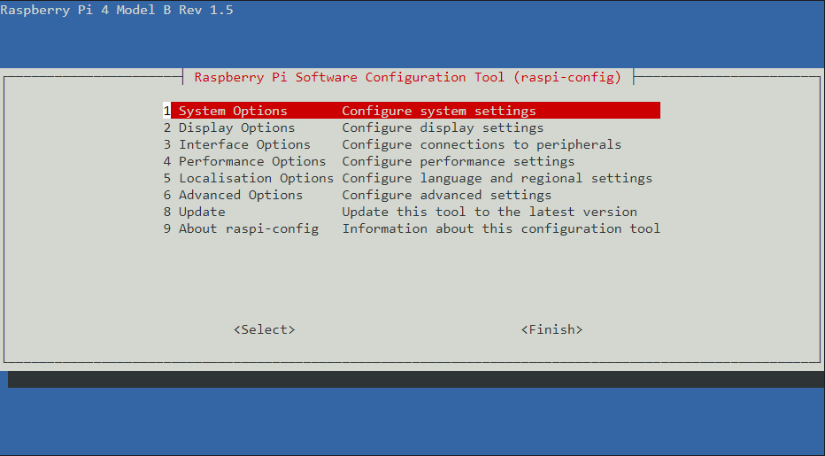
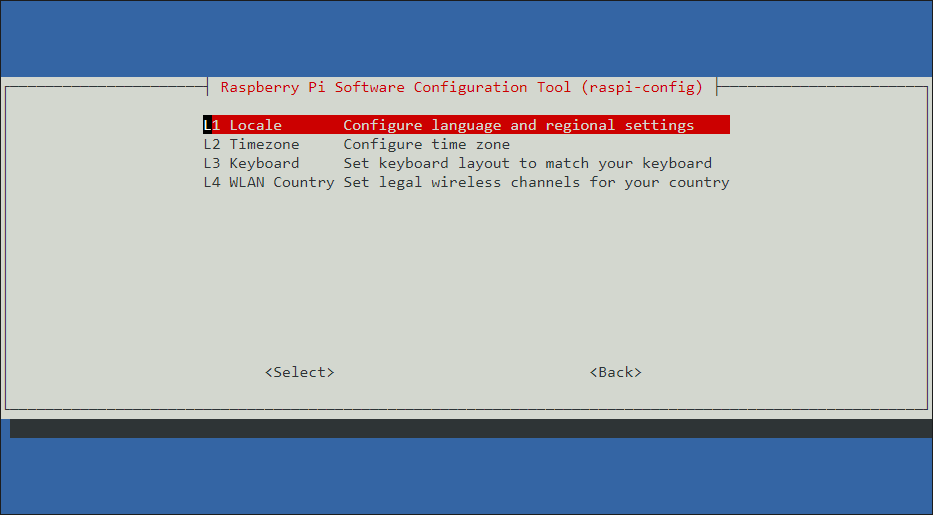
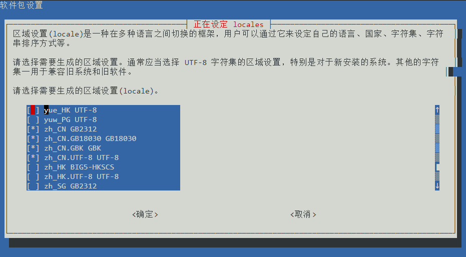

首次开机后，系统需要进行额外的配置来方便使用。

## 系统换源
如果身在国内，那么给树莓派系统换源是必不可少的一步。
### 何为换源
树莓派下载软件的服务器在国外，下载软件时经常出现下载慢、无法更新的情况,所以需要更换为国内的镜像站加快速度。
### 如何换源
我们需要修改`/etc/apt/sources.list`文件中的对应地址。

在换源之前，我们需要首先确定`树莓派系统的架构`，使用`uname -m`命令进行查看。

以下按照`Debian11 bulleyes`安装清华大学镜像源作为示例，版本变动时参考[·清华大学镜像源官方文档·](https://mirrors.tuna.tsinghua.edu.cn/help/raspbian/)：
```md
# armv7l 用户：编辑 `/etc/apt/sources.list` 文件，删除原文件所有内容，用以下内容取代
deb http://mirrors.tuna.tsinghua.edu.cn/raspbian/raspbian/ bullseye main non-free contrib rpi
# deb-src http://mirrors.tuna.tsinghua.edu.cn/raspbian/raspbian/ bullseye main non-free contrib rpi

# armv7l 用户如果需要开启 multi-arch 使用 arm64 软件源，需要在 `/etc/apt/sources.list` 中加上
deb [arch=arm64] http://mirrors.tuna.tsinghua.edu.cn/raspbian/multiarch/ bullseye main

# aarch64 用户：编辑 `/etc/apt/sources.list` 文件，用以下内容取代：
# 默认注释了源码镜像以提高 apt update 速度，如有需要可自行取消注释
deb https://mirrors.tuna.tsinghua.edu.cn/debian/ bullseye main contrib non-free
# deb-src https://mirrors.tuna.tsinghua.edu.cn/debian/ bullseye main contrib non-free
deb https://mirrors.tuna.tsinghua.edu.cn/debian/ bullseye-updates main contrib non-free
# deb-src https://mirrors.tuna.tsinghua.edu.cn/debian/ bullseye-updates main contrib non-free
deb https://mirrors.tuna.tsinghua.edu.cn/debian/ bullseye-backports main contrib non-free
# deb-src https://mirrors.tuna.tsinghua.edu.cn/debian/ bullseye-backports main contrib non-free
deb https://mirrors.tuna.tsinghua.edu.cn/debian-security bullseye-security main contrib non-free
# deb-src https://mirrors.tuna.tsinghua.edu.cn/debian-security bullseye-security main contrib non-free

# 对于两个架构，编辑 `/etc/apt/sources.list.d/raspi.list` 文件，删除原文件所有内容，用以下内容取代：
deb https://mirrors.tuna.tsinghua.edu.cn/raspberrypi/ bullseye main
```
::: info
此处推荐使用vim文本编辑工具对该文件进行修改，但是树莓派官方系统并没有预装vim，需要使用vi修改。对linux系统操作娴熟的同学而言使用vi也毫无问题，对新手确实是一番折磨（表现在光标移动，复制粘贴等方面）。

安装vim 可在控制台输入`sudo apt install vim`命令，但由于还没有换源，需要几分钟的下载时间才能完成。

同时，使用vi或vim编辑文件时请在前面加上sudo以保证有足够的权限修改系统文件。
:::

## 更改语言
1. 打开树莓派终端（或者SSH连接树莓派......Whatever）
2. 在终端中输入`sudo raspi-config` 进入如下界面,选择第五项`Localisation Options`

3. 在下页面中选择第一项`Locale`

4. 随后在进入的页面中勾选`zh-CN(UTF8)`,其它`GB2312`,`GB18030`,`GBK`也可作为可选项。

5. 最后选择确定，在新的页面中选择系统默认语言`zh_CN(UTF-8)`，最后重启即可